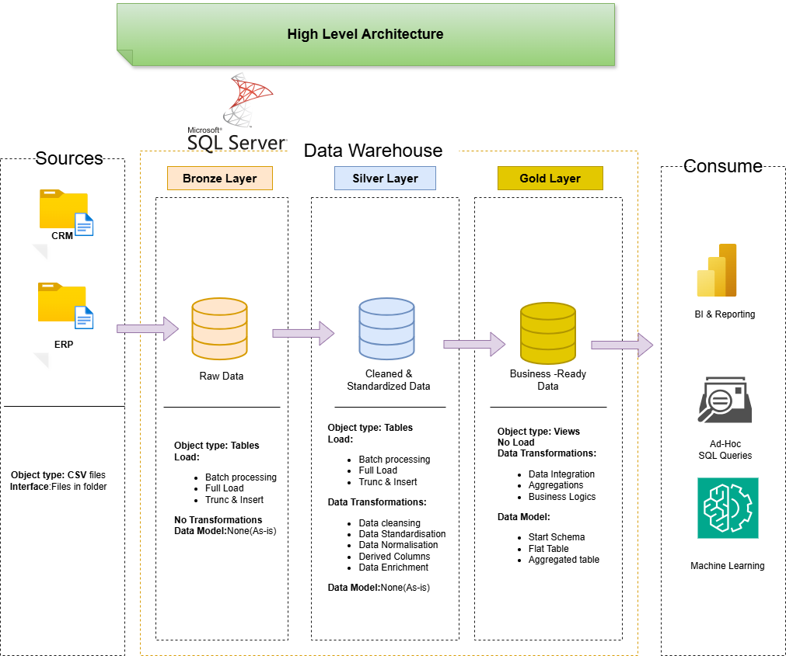

# SQL Data Warehouse & Analytics Project

Welcome to the **SQL Data Warehouse & Analytics Project** repository.  
This project demonstrates an end-to-end data warehousing and analytics solution, from raw data ingestion to business-ready insights. It is designed as a **portfolio project** and follows **industry best practices** in data engineering, data modeling, and analytics.

---

## 🏗️ Data Architecture

The project follows the **Medallion Architecture**, consisting of **Bronze, Silver, and Gold layers**.

### Architecture Layers

- **Bronze Layer**
  - Stores raw data ingested directly from source systems
  - Data is loaded as-is from CSV files into SQL Server

- **Silver Layer**
  - Performs data cleansing, standardization, and normalization
  - Ensures data quality and consistency

- **Gold Layer**
  - Contains business-ready data
  - Data is modeled using a **Star Schema** for reporting and analytics

---

## 📖 Project Overview

This project covers the complete data warehousing lifecycle:

- **Data Architecture**
  - Designing a modern data warehouse using Medallion Architecture

- **ETL Pipelines**
  - Extracting, transforming, and loading data from ERP and CRM systems

- **Data Modeling**
  - Developing fact and dimension tables optimized for analytical queries

- **Analytics & Reporting**
  - Creating SQL-based analytics to generate actionable insights

---

## 🎯 Skills Demonstrated

This repository showcases practical experience in:

- SQL Development  
- Data Engineering  
- Data Architecture  
- ETL Pipeline Development  
- Data Modeling  
- Data Analytics  

---

## 🛠️ Tools & Technologies

All tools used in this project are **free and open-source**:

- **Datasets** – CSV files used as source data  
- **SQL Server Express** – Database engine for data warehousing  
- **SQL Server Management Studio (SSMS)** – Database management and querying  
- **Git & GitHub** – Version control and collaboration  
- **Draw.io** – Architecture, data models, and flow diagrams  
- **Notion** – Project planning and task tracking  

---

## 🚀 Project Requirements

### Building the Data Warehouse (Data Engineering)

**Objective**  
Develop a modern data warehouse using SQL Server to consolidate sales data and enable analytical reporting for informed decision-making.

**Key Requirements**
- Ingest data from ERP and CRM systems provided as CSV files
- Clean and resolve data quality issues
- Integrate multiple sources into a unified analytical data model
- Focus on the latest dataset only (no historization)
- Provide clear documentation for business and analytics users

### BI & Analytics (Data Analysis)

**Objective**  
Develop SQL-based analytics to generate insights related to:

- Customer Behavior  
- Product Performance  
- Sales Trends  

📌 Detailed requirements are documented in:  
`docs/requirements.md`

---

## 📂 Repository Structure

|---LICENSE # MIT License
├── .gitignore # Git ignore rules
└── requirements.txt # Project dependencies

